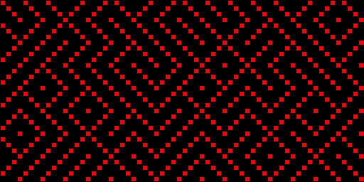

# c8c

c8c aims to be a small typeless programming language for the CHIP-8 virtual machine:

    r = { 0x80, 0x40, 0x20, 0x10 };
    l = { 0x20, 0x40, 0x80, 0x10 };

    main()
    {
        auto x = 0, xmax = 64, dx = 4;
        auto y = 0, ymax = 32, dy = 4;
        while(y < ymax)
        {
            if(rand() & 0x1)
            {
                draw(x, y, r);
            }
            else
            {
                draw(x, y, l);
            }
            if((x += dx) == xmax)
            {
                x = 0;
                y += dy;
            }
        }
        while(1)
        {
            // Never leave main.
        }
    }

Just run:

    make

This will build the CHIP-8 virtual machine, binner, assembler, and compiler.
The compiler will then build all the unit tests (tc8c) and example code pieces (examples).

To run a compiled binary, invoke the virtual machine:

    ./emu examples/maze.bin

To build your own c8 code, piecewise invoke the toolchain:

    ./c8c main.c8 main.asm

    ./asm main.asm main.hex

    ./bin main.hex main.bin

    ./emu main.bin
